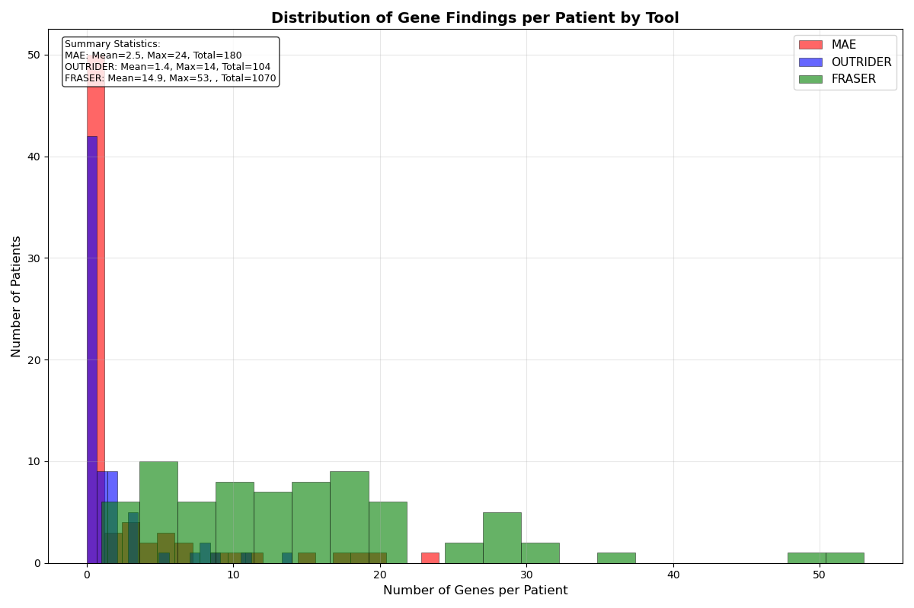
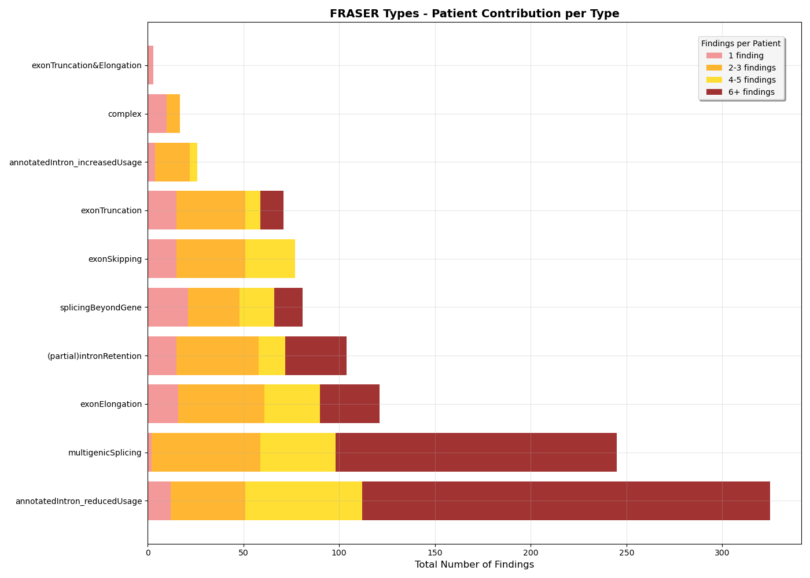
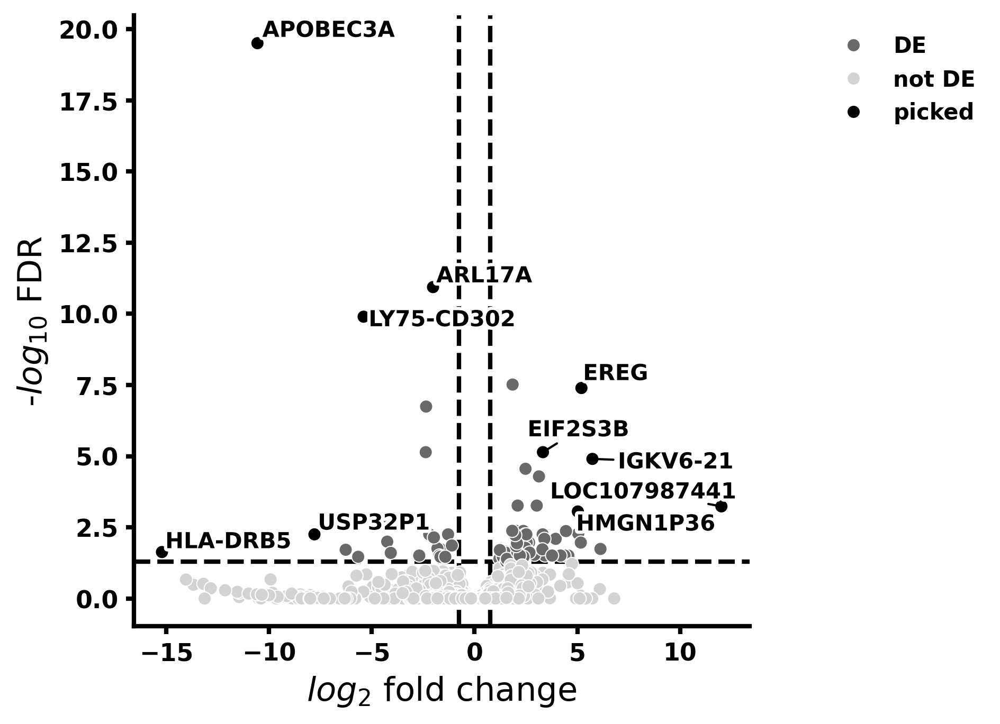
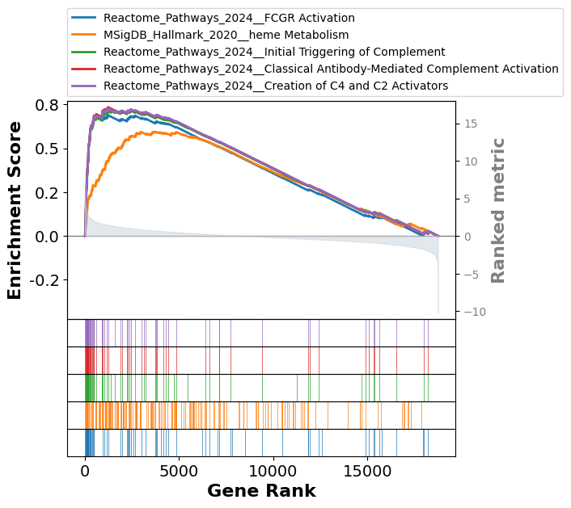

# DROP

Finding the disease-causing variant for a patient based on whole exome or whole genome sequencing is usually possible in less than 50% of cases. Incorporating RNA sequencing can improve this percentage by 8-36%. 

The standard analysis of differential gene expression is usually not preferred for the diagnostics of rare diseases, because there is only one replica for each sample. It is still possible to perform a DESeq2 analysis for each of the affected individuals against a list of the unaffected ones and then do a Gene Set Enrichment Analysis to find the potentially dysregulated pathway. However, there are several other tools that are more tailored for the diagnostics of rare diseases by using statistical methods for fidning outliers.

The DROP pipeline incorporates three of them:
1. OUTRIDER (Outlier in RNA-Seq Finder) that searchs for the events of aberrant expression. It is based on denoising autoencoders and negative binomial distribution.
2. FRASER (Find RAre Splicing Events in RNA-seq) is used to screen the transcripts for the abnormal splicing. It calculates the fraction of reads for each splicing site, employs autoencoders and looks for the outliers from beta-binomial distribution.
3. MAE (Mono-allelic expression) applies a negative binomial test to identify the heterozygous variants that are expressed from only one allele.

The combination of these tools was shown to increas the diagnostic yield by 16%. In this work, this pipeline was applied to a cohort of 75 patients (55 affected) to estimate the number of candidate findings. This project was part of the thesis practical phase at the Hochschule Bonn-Rhein-Sieg.

This was done in 2 steps:
1. The [nf-core/rnaseq](https://nf-co.re/rnaseq/3.14.0/) pipeline was run for the bulk fastq files to get the binary alignment (BAM) files and read counts tables.
2. The DROP pipeline was run via snakemake to find the aberrant events based on the BAM and WGS VCF files.

Both steps were performed on the H-BRS Platform for Scientific Computing using SLURM and Apptainer. Additionally to that, the counts tables were analyzed with pyDESeq2 and GSEApy for the comparison of methods.

The nextflow pipiline was run in a local mode using Ensembl 113 reference genome, as well as STAR as a read aligner and SALMON for quantification of reads. The DROP pipeline was run also with the same reference genome. The MAE module was used for 24 out of 75 patients for whom whole genome sequencing data was available. The pyDESeq2 analysis was done according to the pyDESeq2 example [guide](https://github.com/mousepixels/sanbomics_scripts/blob/main/PyDeseq2_DE_tutorial.ipynb).

To match the findings to the potential explanantion of the phenotype, a list of genes associated with autoinflammmatory diseases was composed from the Infevers databasse and a review paper from 2024. There were 76 genes, variants in which were shown to cause autoinflammation. 

## Statistics

The DROP pipeline yielded several hundreds of anomalies. There were 104 aberrantly expressed genes, 1070 aberrant splicing events and 180 rare variants that were expressed only from the one allele. The distribution of the number of findings per patient is shown on the histogram below.

From the 104 OUTRIDER candidates, there were 6 genes from the AID gene list. However, they were not significantly abnormal across all the genes. The p-value for each of them was below 0.05, as well as the p-value adjusted across the 76 AID genes. But the p-values adjusted across all the genes were not significant.

## FRASER findings

The only module that found aberrant events in the AID genes was FRASER. There were 10 splicing types of events and their distribution is shown on the bar chart.

From the 1070 splicing regions found by FRASER, 7 were in the genes from the AID gene list. There was one partial intron retention, one exon elongation, two exon truncations, one multigenic splicing and two events of the intron reduced usage. Four of them had a variant in RNA sequencing that could potentially explain the aberrant splicing. These were appearances or deletions of the splicing donor/acceptor sites, as well as mutations in the sequences used by members of the spliceosome.

## DESeq2

The median number of differentially expressed genes (DEGs) was 115. In most cases, none of them were in the AID gene list. There were two outliers with 1525 and 2692 DEGs respectively. Out of those, there were 3 and 15 genes from the core AID list. In other cases, these genes were not expressed with significant difference. An example of a volcano plot and GSEA plot is shown on the pictures below.

## Conclusion

The interpretation of the dysregulated pathways was the most difficult part of the DESeq2 analysis. So far none of these findings helped to understand the disease cause. On the contrary, the DROP pipeline provided a few hypotheses for the reason behind the disorder. The literature states that the DROP pipeline helps to improvve the diagnostic yield by 16%. In terms of this project, this many explanations could not have been found. There were around 4 hints for the disease cause. But this was estimated only by taking into account the 76 known genes, and there is more findings to explore.

## References

> Van Gijn ME, Ceccherini I, Shinar Y, Carbo EC, Slofstra M, Arostegui JI, et al. New workflow for classification of genetic variants’ pathogenicity applied to hereditary recurrent fevers by the International Study Group for Systemic Autoinflammatory Diseases (INSAID). Journal of Medical Genetics. 2018 Aug 1;55(8):530–7. 

> Milhavet F, Cuisset L, Hoffman HM, Slim R, El-Shanti H, Aksentijevich I, et al. The infevers autoinflammatory mutation online registry: update with new genes and functions. Human Mutation. 2008;29(6):803–8.

> Touitou I, Lesage S, McDermott M, Cuisset L, Hoffman H, Dode C, et al. Infevers: An evolving mutation database for auto-inflammatory syndromes. Human Mutation. 2004;24(3):194–8.

> Sarrauste de Menthière C, Terrière S, Pugnère D, Ruiz M, Demaille J, Touitou I. INFEVERS: the Registry for FMF and hereditary inflammatory disorders mutations. Nucleic Acids Res. 2003 Jan 1;31(1):282–5. 

> An J, Marwaha A, Laxer RM. Autoinflammatory Diseases: A Review. The Journal of Rheumatology. 2024 Sept 1;51(9):848–61.

> Love MI, Huber W, Anders S. Moderated estimation of fold change and dispersion for RNA-seq data with DESeq2. Genome Biol. 2014 Dec 5;15(12):550.

> Muzellec B, Teleńczuk M, Cabeli V, Andreux M. PyDESeq2: a python package for bulk RNA-seq differential expression analysis. Bioinformatics. 2023 Sept 5;39(9):btad547.

> Fang Z, Liu X, Peltz G. GSEApy: a comprehensive package for performing gene set enrichment analysis in Python. Bioinformatics. 2023 Jan 1;39(1):btac757.

> Yépez VA, Mertes C, Müller MF, Klaproth-Andrade D, Wachutka L, Frésard L, et al. Detection of aberrant gene expression events in RNA sequencing data. Nat Protoc. 2021 Feb;16(2):1276–96. 

> Yépez VA, Gusic M, Kopajtich R, Mertes C, Smith NH, Alston CL, et al. Clinical implementation of RNA sequencing for Mendelian disease diagnostics. Genome Med. 2022 Apr 5;14(1):38. 

> Brechtmann F, Mertes C, Matusevičiūtė A, Yépez VA, Avsec Ž, Herzog M, et al. OUTRIDER: A Statistical Method for Detecting Aberrantly Expressed Genes in RNA Sequencing Data. The American Journal of Human Genetics. 2018 Dec;103(6):907–17. 

> Ewels PA, Peltzer A, Fillinger S, Alneberg J, Patel H, Wilm A, et al. nf-core: Community curated bioinformatics pipelines [Internet]. 2019 [cited 2025 Apr 7]. Available from: https://www.biorxiv.org/content/10.1101/610741v1

> Kremer LS, Bader DM, Mertes C, Kopajtich R, Pichler G, Iuso A, et al. Genetic diagnosis of Mendelian disorders via RNA sequencing. Nat Commun. 2017 June 12;8(1):15824.

> Dobin A, Davis CA, Schlesinger F, Drenkow J, Zaleski C, Jha S, et al. STAR: ultrafast universal RNA-seq aligner. Bioinformatics. 2013 Jan 1;29(1):15–21. 

> Patro R, Duggal G, Love MI, Irizarry RA, Kingsford C. Salmon provides fast and bias-aware quantification of transcript expression. Nat Methods. 2017 Apr;14(4):417–9.